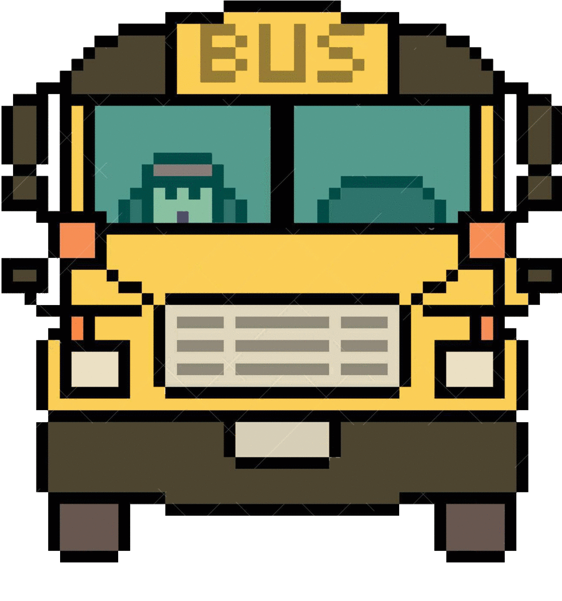

# TB1 - Inteligencia Artificial

## Pequeño gran Vistazo




## Comenzando 🚀

_Estas instrucciones te permitirán obtener una copia del proyecto en funcionamiento en tu máquina local para propósitos de desarrollo y pruebas._

Debe de asegurarse de tener "Python" instalado en su ordenado desde la versión 3.0 para adelante y el instalador de paquetes "pip" también en su versión más actualizada.


### Pre-requisitos 📋

_Este proyecto utiliza propiedades de esta librería para el reconocimiento de eventos y ejecución del diseño de interfaz_

```
Pygame
```

### Instalación 🔧

_Clonación del repositorio_

```
git clone https://github.com/CFSanchezV/TB1-IA
```

#### Windows 10

_Instalación de Pygame en Windows 10_

```
pip install pygame
```

### Linux

_Instalación de Pygame en Linux_

```
sudo apt-get install python3-pygame
```
_Si ocurre algún problema consulte el siguiente [link](https://riptutorial.com/es/pygame/example/16814/instalando-pygame)_


## Construido con 🛠️

* [Pygame](https://www.pygame.org/news) - Documentación de pygame


## Autores ✒️

* **Christian Sanchez** 
* **Fernando Valdiviezo** 
* **Frank Zegarra** 